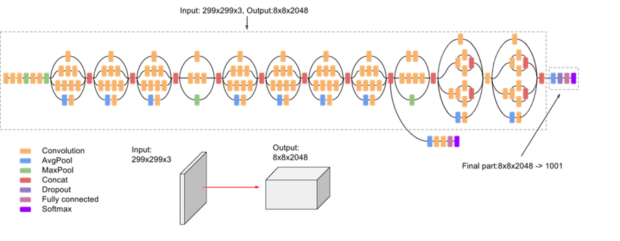
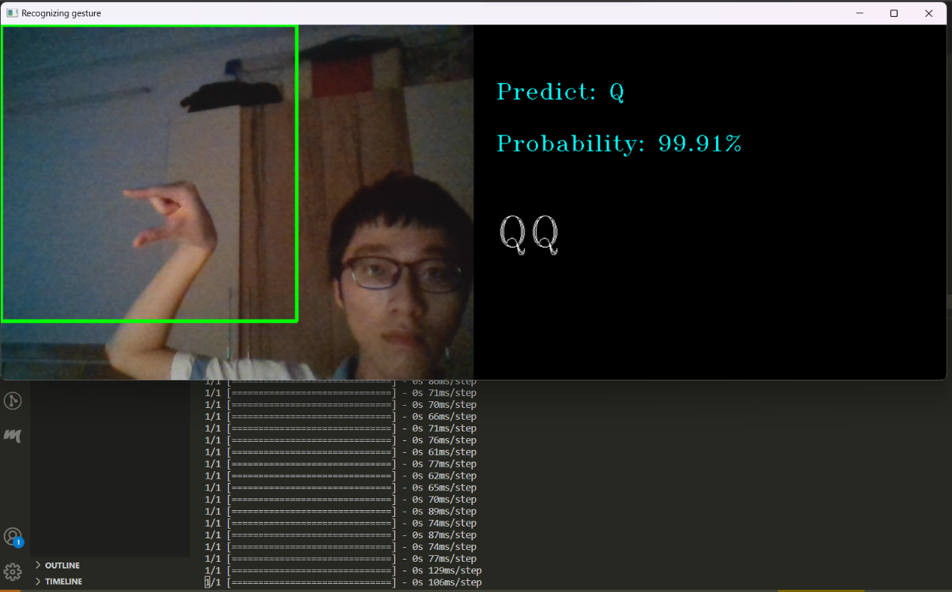

# Đề tài: Xây dựng hệ thống nhận diện ngôn ngữ ký hiệu tay sử dụng học sâu
Sinh viên thực hiện: Lê Đức Quân   
Lớp: IT1-K65   
Trường: Công nghệ thông tin - ĐHBKHN

# Chạy chương trình
Công nghệ sử dụng: Python, Tensorflow
## 1. Huấn luyện mô hình
**Note: Trước khi huấn luyện tải bộ dữ liệu trên Kaggle theo đường dẫn:    [ASL Alphabet](https://www.kaggle.com/datasets/grassknoted/asl-alphabet?datasetId=23079&sortBy=voteCount) 
. Giải nén ra thư mục `./data/`**

Bước 1: Tải các thư viện cần thiết bằng pip, gõ trên terminal như sau:    
`pip install -r requirements.txt`   
Bước 2: Chạy script sau:   
`python src/train.py`  
**Note: Có thể chạy trực tiếp trên google colab: [Project 2](https://www.kaggle.com/datasets/grassknoted/asl-alphabet?datasetId=23079&sortBy=voteCount)**
## 2. Chương trình nhận diện bằng webcam 
Trên terminal gõ lệnh sau để chạy chương trình:   
`python app.py`   
Khi đó, webcam trên máy tính sẽ bắt 1 khung hình cố định và thực hiện dự đoán trên đó

# Model
Transfer learning mô hình Inception V3

 

# Kết quả
- Training accuracy:

- Fine-tune accuracy:

- Confusion matrix:

- Predict: 

# Reference

[1] Hands-On Machine Learning with Scikit-Learn, Keras, and TensorFlow, 2nd 
Edition

[2] [1409.4842] Going Deeper with Convolutions (arxiv.org)

